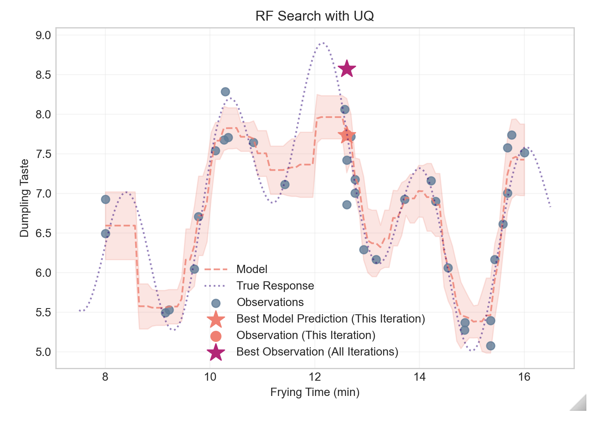

# model-based-optimization
 
Repo for a Notebook-based tutorial on model-based optimization using a Random Forest model with prediction uncertainties (similar to Bayesian Optimization). Utilizes the [lolopy](https://pypi.org/project/lolopy/) library.

